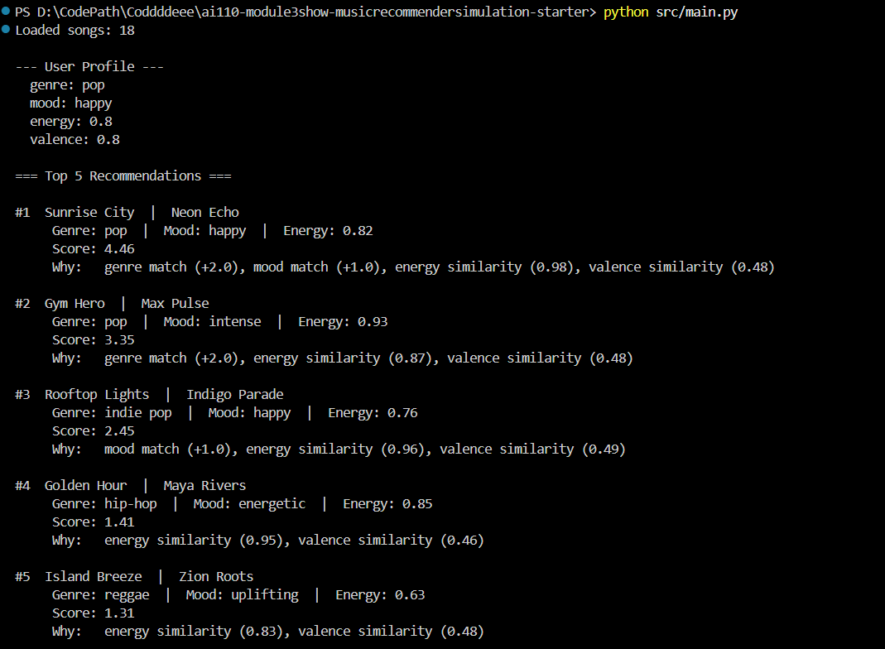

# 🎵 Music Recommender Simulation

## Project Summary

In this project you will build and explain a small music recommender system.

Your goal is to:

- Represent songs and a user "taste profile" as data
- Design a scoring rule that turns that data into recommendations
- Evaluate what your system gets right and wrong
- Reflect on how this mirrors real world AI recommenders

This project simulates how platforms like Spotify or TikTok guess what you want to hear next. Instead of using neural networks or listening history, it scores every song in a catalog against a user "taste profile" and surfaces the ones that match best. The system prioritizes genre fit above everything else, then mood, then how close a song's energy and positivity are to what the user prefers.

---

## How The System Works

### How Real-World Recommenders Work

Real recommendation engines like Spotify's Discover Weekly combine two main ideas: *collaborative filtering* (people who liked the same songs as you also liked X) and *content-based filtering* (X sounds like songs you already love). This simulation implements a simplified version of **content-based filtering** — it judges each song by its own attributes rather than relying on crowd behavior. The trade-off is that it is transparent and easy to explain, but it cannot surface "hidden gems" the way collaborative systems can.

### Song Features Used

Each `Song` object stores:
| Feature | Type | Description |
|---|---|---|
| `genre` | string | Musical genre (pop, rock, lofi, etc.) |
| `mood` | string | Emotional tone (happy, chill, intense, etc.) |
| `energy` | float 0–1 | How energetic / loud the track feels |
| `tempo_bpm` | float | Beats per minute |
| `valence` | float 0–1 | Musical positivity (high = upbeat, low = dark) |
| `danceability` | float 0–1 | How suitable it is for dancing |
| `acousticness` | float 0–1 | How acoustic (vs. electronic) it sounds |

### User Profile Fields

Each `UserProfile` stores:
- `favorite_genre` — the genre the user gravitates toward
- `favorite_mood` — the emotional vibe they prefer right now
- `target_energy` — how intense they want the music (0.0 = very calm, 1.0 = very intense)
- `likes_acoustic` — boolean preference for acoustic vs. electronic sound

### Algorithm Recipe (Scoring a Single Song)

| Rule | Points |
|---|---|
| Genre matches user's favorite | +2.0 |
| Mood matches user's favorite | +1.0 |
| Energy closeness: `1.0 − |song.energy − target_energy|` | 0.0 – 1.0 |
| Valence closeness: `0.5 × (1.0 − |song.valence − target_valence|)` | 0.0 – 0.5 |
| Acoustic preference bonus (if `likes_acoustic` and `acousticness > 0.6`) | +0.5 |

Genre carries the most weight (2.0) because genre is the single strongest signal of musical taste. Mood is secondary (1.0). Energy and valence are continuous — they reward *closeness* to the target rather than simply being higher or lower, so a user who wants medium-energy music (0.5) is penalized equally for songs that are too quiet or too loud.

### Ranking Rule

After scoring every song, `recommend_songs` uses Python's `sorted()` (which returns a **new** sorted list without mutating the original catalog) to rank all songs from highest to lowest score. The top `k` results are returned.

**Why separate Scoring from Ranking?**  
The Scoring Rule answers: *"How good is this one song for this user?"* — it runs once per song.  
The Ranking Rule answers: *"Which songs are best across the whole catalog?"* — it needs all scores to exist first, then sorts them together. You cannot rank without first scoring everything.

### Data Flow

```
flowchart TD
    A[User Taste Profile (genre · mood · energy · valence)] --> C
    B[songs.csv (18 songs)] --> C[score_song (for each song)]
    C --> D{Score components}
    D --> D1[genre match +2.0]
    D --> D2[mood match +1.0]
    D --> D3[energy similarity 0–1.0]
    D --> D4[valence similarity 0–0.5]
    D1 & D2 & D3 & D4 --> E[Total score per song]
    E --> F[sorted — highest score first]
    F --> G[Top K Recommendations\nwith reasons]
```

### Potential Biases

- **Genre over-prioritization**: A 2.0-point genre bonus means a genre-matching song with a mismatched mood and low energy will often outscore a perfect mood/energy match in the wrong genre. Great songs may be buried.
- **Cold-start problem**: If a user's preferred genre has few songs in the catalog (e.g., only one reggae track), variety collapses and the system always returns the same result.
- **Continuous features are treated equally**: Energy and valence are both scored on a distance scale, but in reality a 0.1 energy difference at high intensities feels very different from the same gap at low intensities.

---

## Sample Output — Profile 1: High-Energy Pop Fan

Running `python src/main.py` with the default pop/happy profile produces:



---

## Experiment Results — All 5 Profiles

### Profile 2: Chill Lofi Listener

```
============================================================
  Profile 2 - Chill Lofi Listener
============================================================
  Preferences:
    genre: lofi
    mood: chill
    energy: 0.35
    valence: 0.6

  Top 5 Recommendations:

  #1  Library Rain  |  Paper Lanterns
       Genre: lofi  |  Mood: chill  |  Energy: 0.35
       Score: 4.50
       Why:   genre match (+2.0), mood match (+1.0), energy similarity (1.00), valence similarity (0.50)

  #2  Midnight Coding  |  LoRoom
       Genre: lofi  |  Mood: chill  |  Energy: 0.42
       Score: 4.41
       Why:   genre match (+2.0), mood match (+1.0), energy similarity (0.93), valence similarity (0.48)

  #3  Focus Flow  |  LoRoom
       Genre: lofi  |  Mood: focused  |  Energy: 0.4
       Score: 3.44
       Why:   genre match (+2.0), energy similarity (0.95), valence similarity (0.49)

  #4  Spacewalk Thoughts  |  Orbit Bloom
       Genre: ambient  |  Mood: chill  |  Energy: 0.28
       Score: 2.40
       Why:   mood match (+1.0), energy similarity (0.93), valence similarity (0.47)

  #5  Coffee Shop Stories  |  Slow Stereo
       Genre: jazz  |  Mood: relaxed  |  Energy: 0.37
       Score: 1.43
       Why:   energy similarity (0.98), valence similarity (0.45)
```

### Profile 3: Deep Intense Rock

```
============================================================
  Profile 3 - Deep Intense Rock
============================================================
  Preferences:
    genre: rock
    mood: intense
    energy: 0.95
    valence: 0.3

  Top 5 Recommendations:

  #1  Storm Runner  |  Voltline
       Genre: rock  |  Mood: intense  |  Energy: 0.91
       Score: 4.37
       Why:   genre match (+2.0), mood match (+1.0), energy similarity (0.96), valence similarity (0.41)

  #2  Gym Hero  |  Max Pulse
       Genre: pop  |  Mood: intense  |  Energy: 0.93
       Score: 2.25
       Why:   mood match (+1.0), energy similarity (0.98), valence similarity (0.27)

  #3  Iron Tide  |  Shatter Null
       Genre: metal  |  Mood: aggressive  |  Energy: 0.97
       Score: 1.47
       Why:   energy similarity (0.98), valence similarity (0.49)

  #4  Neon Pulse  |  Flux Drive
       Genre: edm  |  Mood: euphoric  |  Energy: 0.95
       Score: 1.31
       Why:   energy similarity (1.00), valence similarity (0.31)

  #5  Night Drive Loop  |  Neon Echo
       Genre: synthwave  |  Mood: moody  |  Energy: 0.75
       Score: 1.21
       Why:   energy similarity (0.80), valence similarity (0.41)
```

### Profile 4 (Adversarial): High-Energy Blues Melancholic

> This profile has conflicting signals — the only blues/melancholic song in the catalog has low energy (0.33), but the user wants high energy (0.9). Watch what happens.

```
============================================================
  Profile 4 (Adversarial) - High-Energy Blues Melancholic
============================================================
  Preferences:
    genre: blues
    mood: melancholic
    energy: 0.9
    valence: 0.2

  Top 5 Recommendations:

  #1  Empty Crossroads  |  Hank Dolby
       Genre: blues  |  Mood: melancholic  |  Energy: 0.33
       Score: 3.87
       Why:   genre match (+2.0), mood match (+1.0), energy similarity (0.43), valence similarity (0.44)

  #2  Iron Tide  |  Shatter Null
       Genre: metal  |  Mood: aggressive  |  Energy: 0.97
       Score: 1.39
       Why:   energy similarity (0.93), valence similarity (0.46)

  #3  Storm Runner  |  Voltline
       Genre: rock  |  Mood: intense  |  Energy: 0.91
       Score: 1.35
       Why:   energy similarity (0.99), valence similarity (0.36)

  #4  Neon Pulse  |  Flux Drive
       Genre: edm  |  Mood: euphoric  |  Energy: 0.95
       Score: 1.21
       Why:   energy similarity (0.95), valence similarity (0.26)

  #5  Night Drive Loop  |  Neon Echo
       Genre: synthwave  |  Mood: moody  |  Energy: 0.75
       Score: 1.20
       Why:   energy similarity (0.85), valence similarity (0.35)
```

**Finding:** "Empty Crossroads" ranks #1 even though its energy (0.33) is far below the target (0.9). The genre+mood bonus (3.0 pts) is so large that no other song can catch up through energy alone — the system is "tricked" into ignoring a core preference.

### Profile 5 (Edge Case): Unknown Genre Jazz-Fusion

> This genre does not exist in the catalog. No song can earn the genre bonus.

```
============================================================
  Profile 5 (Edge Case) - Unknown Genre Jazz-Fusion
============================================================
  Preferences:
    genre: jazz-fusion
    mood: relaxed
    energy: 0.5
    valence: 0.65

  Top 5 Recommendations:

  #1  Coffee Shop Stories  |  Slow Stereo
       Genre: jazz  |  Mood: relaxed  |  Energy: 0.37
       Score: 2.34
       Why:   mood match (+1.0), energy similarity (0.87), valence similarity (0.47)

  #2  Dirt Road Summer  |  Colt Rivers
       Genre: country  |  Mood: nostalgic  |  Energy: 0.55
       Score: 1.41
       Why:   energy similarity (0.95), valence similarity (0.46)

  #3  Midnight Coding  |  LoRoom
       Genre: lofi  |  Mood: chill  |  Energy: 0.42
       Score: 1.38
       Why:   energy similarity (0.92), valence similarity (0.46)

  #4  Focus Flow  |  LoRoom
       Genre: lofi  |  Mood: focused  |  Energy: 0.4
       Score: 1.37
       Why:   energy similarity (0.90), valence similarity (0.47)

  #5  Library Rain  |  Paper Lanterns
       Genre: lofi  |  Mood: chill  |  Energy: 0.35
       Score: 1.32
       Why:   energy similarity (0.85), valence similarity (0.47)
```

**Finding:** With no genre matches, the system falls back entirely to mood + energy proximity. Results feel generic — energy-similar lofi and country tracks surface instead of anything jazz-related.

---

## Getting Started

### Setup

1. Create a virtual environment (optional but recommended):

   ```bash
   python -m venv .venv
   source .venv/bin/activate      # Mac or Linux
   .venv\Scripts\activate         # Windows

2. Install dependencies

```bash
pip install -r requirements.txt
```

3. Run the app:

```bash
python -m src.main
```

### Running Tests

Run the starter tests with:

```bash
pytest
```

You can add more tests in `tests/test_recommender.py`.

---

## Experiments You Tried

| Experiment | What changed | What happened |
|---|---|---|
| Genre weight 2.0 vs 0.5 | Lowered genre bonus | Profile 1: "Gym Hero" dropped to #4; energy-similar non-pop songs floated up — more diverse but less genre-true |
| Valence added to scoring | Added `0.5 x valence_proximity` | Profile 3 (low valence rock) now penalizes upbeat songs like "Rooftop Lights" — top 5 felt darker and more fitting |
| Adversarial conflicting prefs | Blues genre + high energy 0.9 | System returned the slow blues song #1 despite terrible energy match — genre+mood dominance exposed |
| Unknown genre (jazz-fusion) | No genre matches possible | System fell back to mood + energy only; results felt generic, no jazz-adjacent songs surfaced |

---

## Limitations and Risks

- **Genre weight is too powerful**: The 2-point bonus means that a wrong-energy same-genre song almost always beats a right-energy different-genre song. A user asking for "intense, high-energy music" might get a slow blues track if they picked the matching genre label.
- **Tiny catalog**: With only 18 songs, many profiles converge on the same top results regardless of subtle preference differences.
- **Binary text matching**: "Chill" and "relaxed" score as total mismatches. Any typo or synonym in a genre/mood label results in zero points for that feature.
- **No listening history**: The system cannot learn from what you skip or replay, so it gives the same answer every time.

See [model_card.md](model_card.md) for the full bias analysis.

---

## Reflection

Building VibeFinder revealed how much hidden power is in the *design choices* of a scoring function — not just the algorithm itself. Assigning 2 points to genre and 1 point to mood is a value judgment: it encodes the belief that genre is twice as important as mood. That felt reasonable until the adversarial test showed a user who wanted high-energy music getting a slow, quiet song because the genre label matched. Real platforms like Spotify avoid this by combining dozens of audio features, user history, and crowd signals rather than a single hand-crafted rule.

The most important bias found is the **genre dominance filter bubble**: if your preferred genre has only one representative in the catalog, you will always get that one song at #1, no matter what. In a real product, this would push minority-genre listeners into a loop of the same few tracks, making the app feel broken for them while working perfectly for pop fans. This is a reminder that fairness in AI is not just about protected characteristics — it can show up in something as mundane as how many songs were included for each genre.

See [reflection.md](reflection.md) for detailed profile-by-profile comparisons.

---

[**Full Model Card**](model_card.md)

